# Front-End Repo for Node/React Practicum

**Project Management System MycelFlow** is a modern, full-stack project management application designed specifically for managing event projects with intuitive task tracking, team collaboration, and progress monitoring.

**Project Overview**
The Event Management System is a comprehensive web application that helps teams organize, track, and manage event projects efficiently. Users can create projects, break them down into manageable steps with subtasks, set deadlines, upload project images, and monitor progress in real-time.

**Team Members**

_Frontend_ <a href="https://www.linkedin.com/in/%D0%B0lmira-%D0%BAoshkina-502822338/">Frontend React developer Almira</a>
_Fullstack_ <a href="https://www.linkedin.com/in/anna-bazileeva/">Full stack developer Anna</a>

**Tech Stack**
React 18 - Modern React with functional components and hooks
React Router DOM - Client-side routing and navigation
Tailwind CSS - Utility-first CSS framework for styling
Vite - Fast build tool and development server

**Frontend Setup**
1.Clone the repo
     git clone git@github.com:Code-the-Dream-School/jj-practicum-team-5-front.git
     cd jj-practicum-team-5-front
2.Install dependencies
     npm install
3.Environment Configuration
      Create a .env file in the frontend directory:
        VITE_API_URL=http://localhost:8000
4.Start the development server
        npm run dev
5.Access the application
        Open your browser and navigate to http://localhost:5173

**Project Structure**

Project Management System MycelFlow/
├── frontend/
│   ├── src/
│   │   ├── components/
│   │   │   ├── ProgressBar.jsx
│   │   │   ├── Timeline.jsx
│   │   │   └── DueBanner.jsx
│   │   │   ├── Badge.jsx
│   │   │   ├── EditProject.jsx
│   │   │   ├── NewStepModal.jsx
│   │   │   └── Navbar.jsx
├   │   │──  contexts/
│   │   │    ├── AuthContext.jsx
├   │   │── layouts/
│   ├   │    │── MainLayout.jsx
│   │   ├── pages/
│   │   │   ├── Dashboard.jsx
│   │   │   ├── HomePage.jsx
│   │   │   ├── SignUpForm.jsx
│   │   │   ├── ProjectFormPage.jsx
│   │   │   └── StepPage.jsx
│   │   │   ├── LoginPage.jsx
│   │   │   ├── ProjectPage.jsx
│   │   │   ├── NotFound.jsx
│   │   │   └── TeamPage.jsx
│   │   ├── router/
│   │   │   ├── AppRouter.jsx
│   │   ├── shared/
│   │   │   ├── Footer.jsx
│   │   │   ├── Header.jsx
│   │   ├── styles/
│   │   │   ├── Footer.module.css
│   │   │   ├── Header.module.css
│   │   │   ├── HomePage.module.css
│   │   ├── utils/
│   │   │   ├── due.js
│   │   │   └── derive.js
│   │   │   ├── projectsStore.js
│   │   │   └── storage.js
│   │   └── App.css
│   │   └── App.jsx
│   │   └── main.jsx
│   ├── public/
│   │   └── images/
└── package.json
└── index.html
└── tailwind.config.js
└── vite.config.js
└── README.md

**Task Management**

Dynamic Steps: Add, edit, and remove project steps
Subtasks: Break down steps into detailed subtasks
Progress Tracking: Real-time progress calculation based on completed subtasks
Due Date Management: Set and track deadlines for individual steps

**Project Analytics**

Total projects count
Completed projects tracking
In-progress project monitoring
Overdue project alerts

**User Interface**

Responsive Design: Works seamlessly on desktop and mobile devices, Modern UI with TailwindCSS
Modern Aesthetics: Gradient backgrounds and smooth animations
Interactive Elements: Hover effects and transition animations
Status Indicators: Color-coded project and step statuses
Timeline Visualization: Visual progress tracking for project steps

**Future Enhancements**

Team collaboration features
Email notifications for due dates
AI integration for smart task recommendations and project insights

**Screenshots**

### Home Page
Landing page with modern gradient design and call-to-action buttons
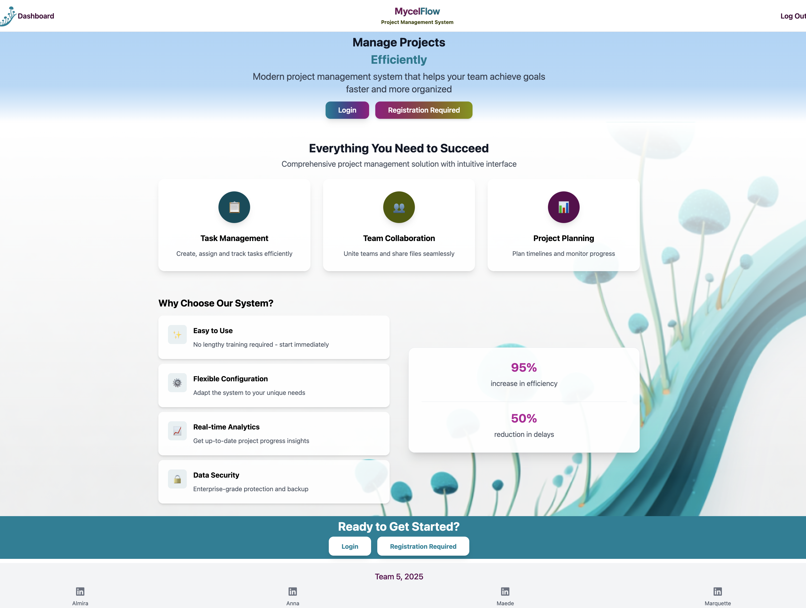

### Dashboard
Main dashboard showing project overview with progress tracking and statistics
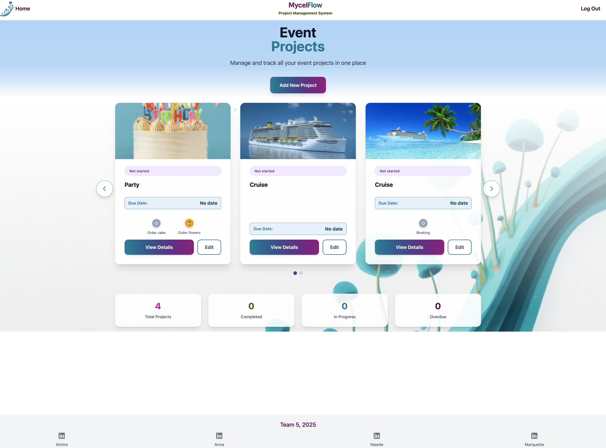
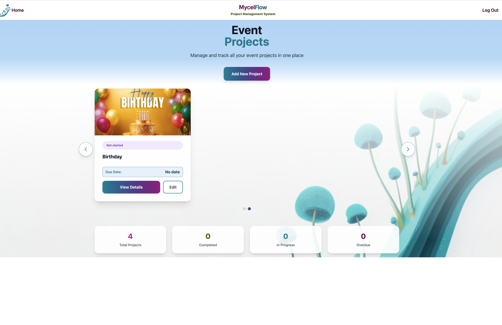

### Project Form
Project creation form with step management and image upload
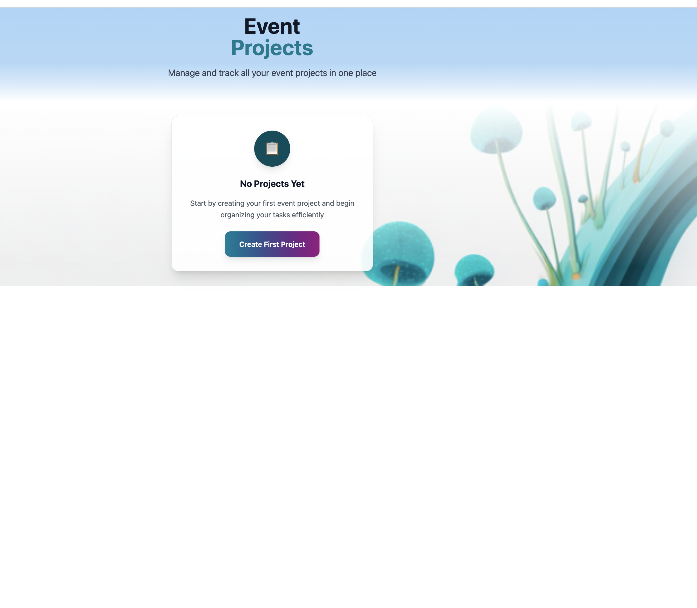
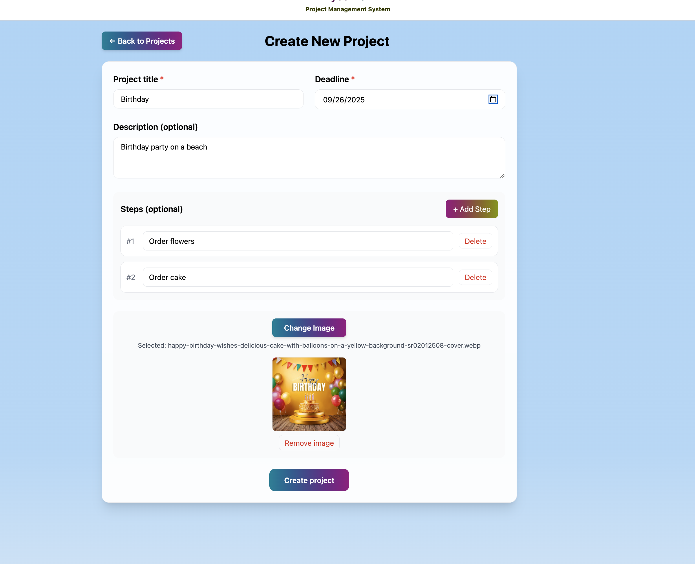

### Project Details
Detailed project view with timeline and task management
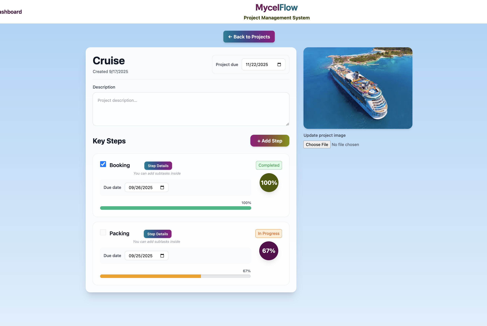

### Step Management
Individual step page with subtask tracking and progress monitoring
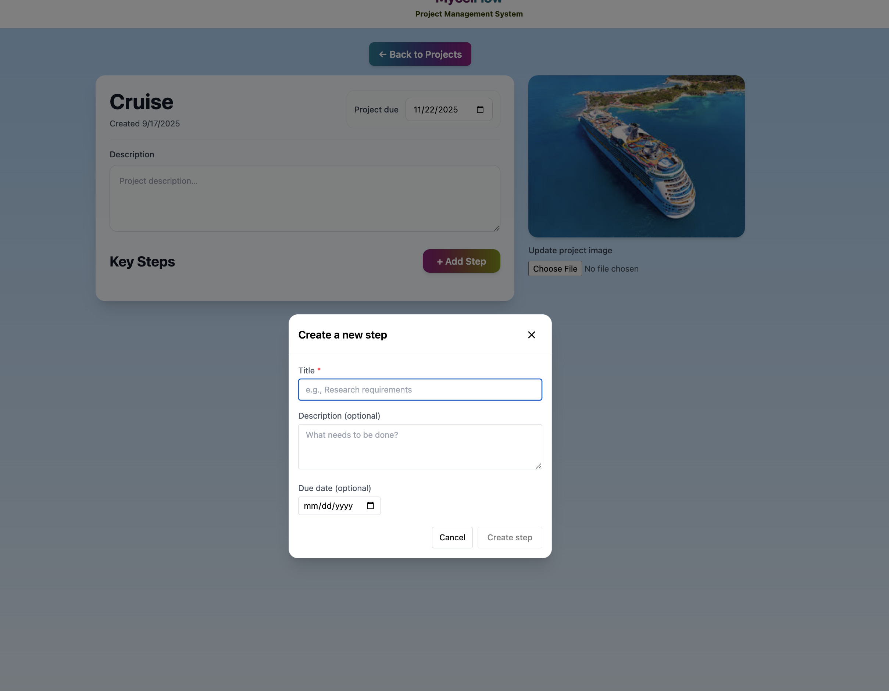
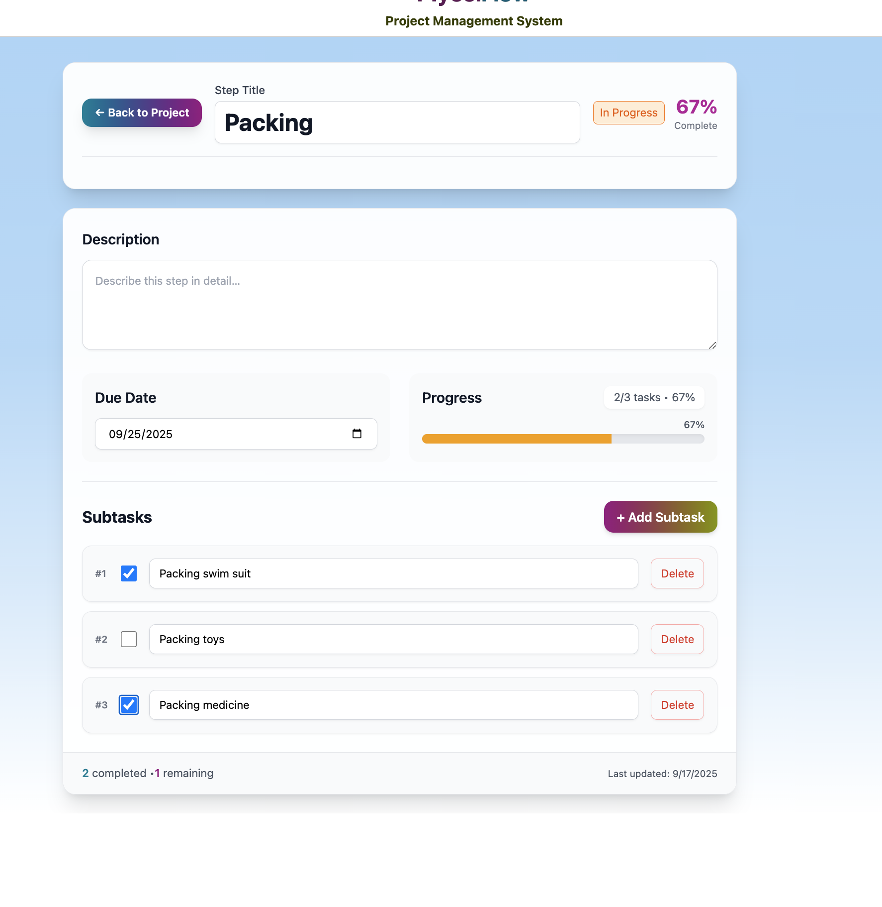

### Authentication
Clean and modern authentication interface
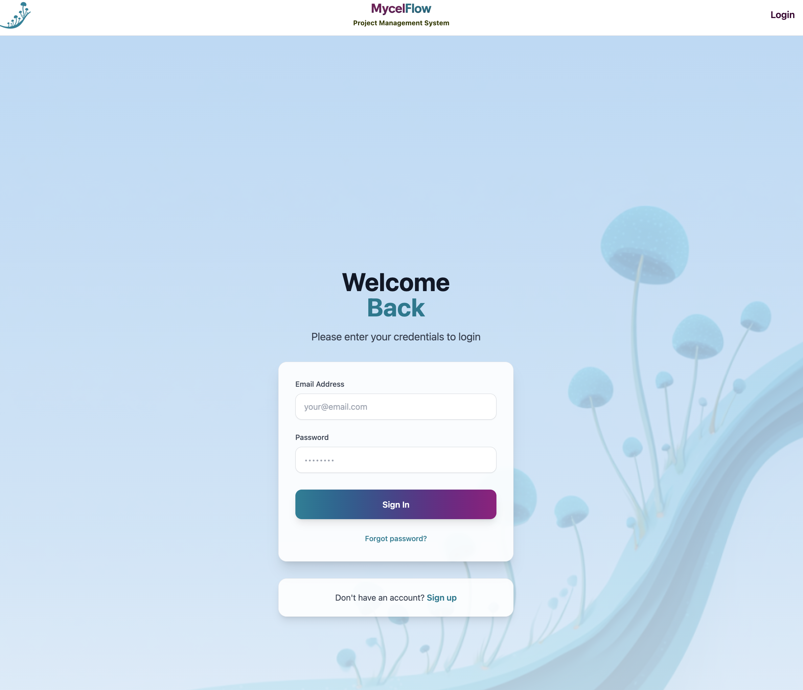
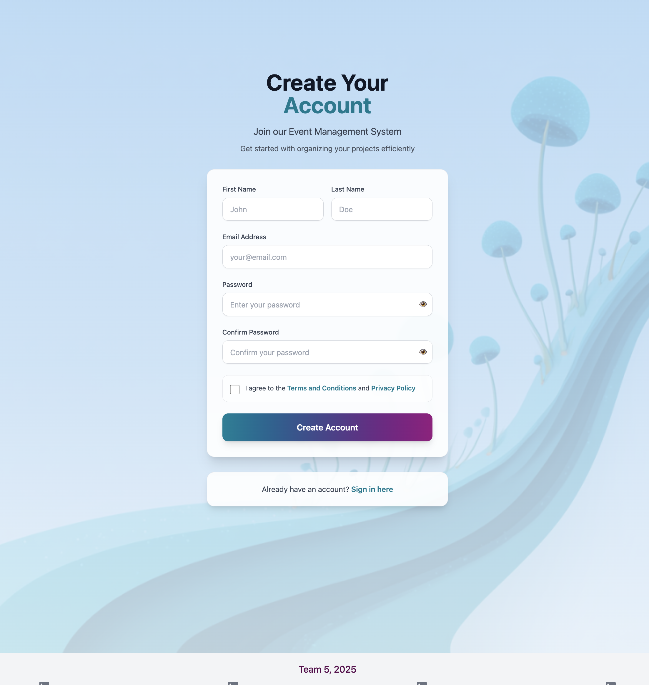

### Team Page
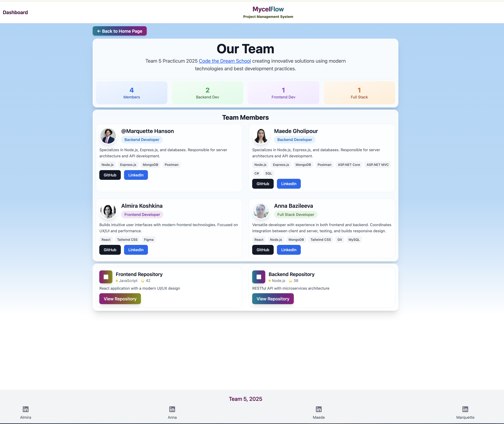

### Responsive Design
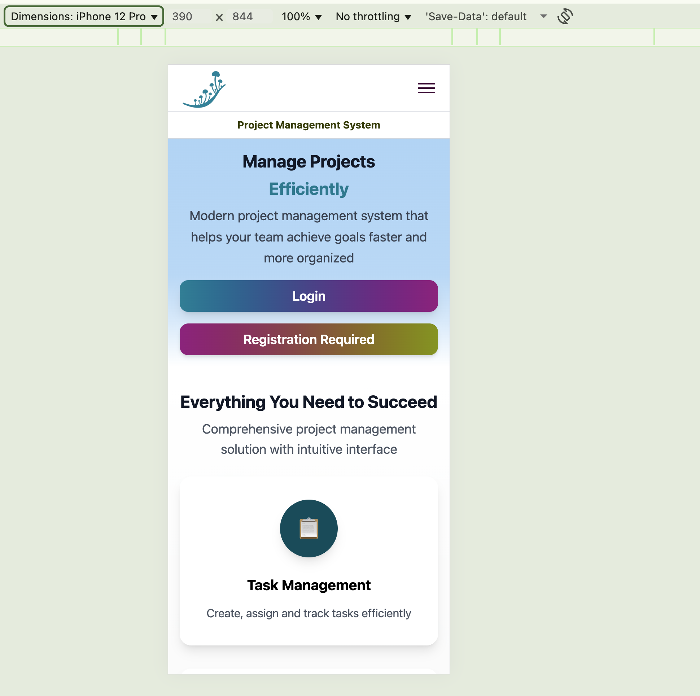

Built with ❤️ by the MycelFlow Team